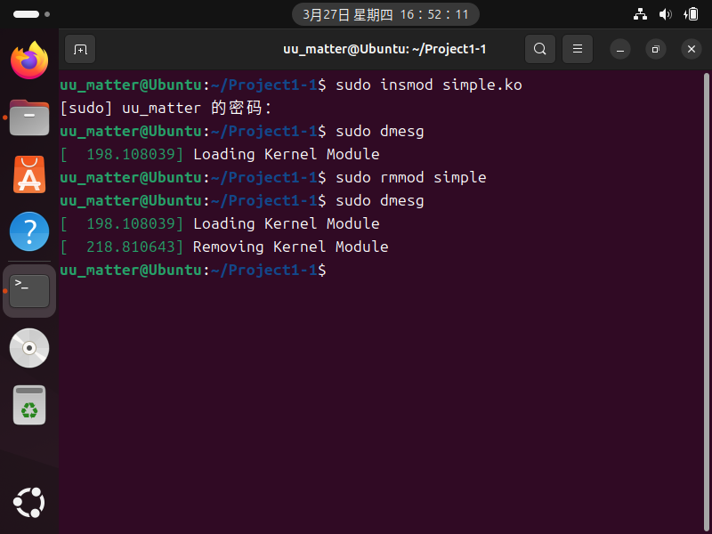
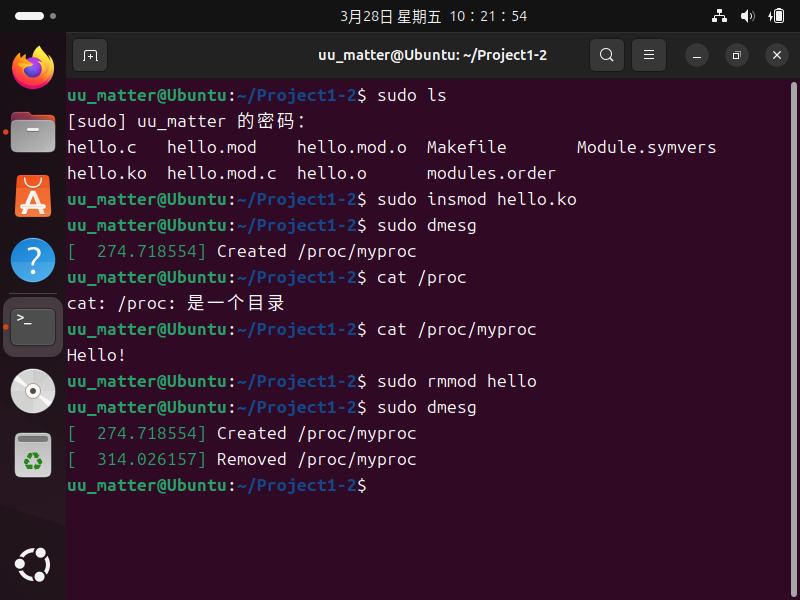
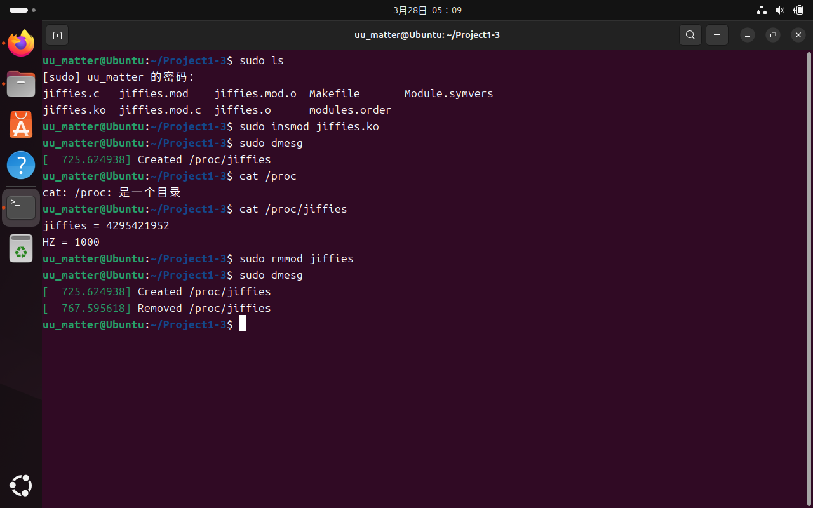
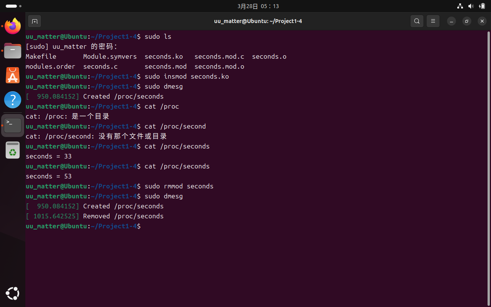

# Project 1 Report

## 1-1 内核模块概述

下载OSC10E配套代码，转到源代码文件夹下使用命令`make`编译得到`simple.ko`，使用命令`sudo insmod simple.ko`将模块插入内核，使用命令`sudo dmesg`查看内核日志缓冲区，发现内核日志`Loading Kernel Module`，说明内核模块已加载；使用命令`sudo rmmod simple`移除内核模块，再次使用命令`sudo dmesg`查看内核日志缓冲区，发现内核日志`Removing Kernel Module`，说明内核模块已被移除

源码`Source Code\Project1-1\simple.c`

## 1-2 /proc文件系统概述

由于OSC10E配套代码已不适用于最新Linux内核，故采用高版本API
将`hello.ko`插入内核后，使用命令`cat /proc`，命令行提示`cat: /proc: 是一个目录`，使用命令`cat /proc/myproc`，得到信息`Hello!`，说明目录和文件已创建

源码`Source Code\Project1-2\hello.c`

## 1-3 jiffies和HZ的值

将1-2中的路径`myproc`改为`jiffies`，将报告函数中的输出提示信息`Hello!`改为输出变量的值`jiffies`与`HZ`即可

将`jiffies.ko`插入内核后，使用命令`cat /proc/jiffies`，得到信息`jiffies`与`HZ`的值，说明功能已实现

源码`Source Code\Project1-3\jiffies.c`

## 1-4 内核模块自加载以来的秒数

由于`jiffies`变量跟踪的是自系统启动以来发生定时器中断的数量，因此要记录内核加载时刻的`jiffies`，计算加载模块时使用命令时`jiffies`的差值，并除以`HZ`，以此方法得到秒数

将`seconds.ko`插入内核后，使用命令`cat /proc/seconds`，得到信息自模块插入内核以来的秒数，再次使用命令`cat /proc/seconds`，再次得到信息自模块插入内核以来的秒数，两次得到秒数的差值为两次使用命令的时间间隔，说明功能已实现

源码`Source Code\Project1-4\seconds.c`

## 1-5 Bonus：copy_to_user()和memcpy()的差异

`copy_to_user()`和`memcpy()`都是用于内存拷贝的函数，但它们在Linux内核中有重要区别：

### 主要差异

#### 使用场景

`copy_to_user()`：用于从内核空间拷贝数据到用户空间；`memcpy()`：用于在内核空间内部或用户空间内部进行内存拷贝

#### 安全性检查

`copy_to_user()`会验证目标用户空间地址是否有效且可写；`memcpy()`不进行任何安全检查，假设调用者已确保参数正确

#### 返回值

`copy_to_user()`返回未能成功拷贝的字节数（成功时返回0）；`memcpy()`返回目标地址指针

#### 上下文要求

`copy_to_user()`只能在用户上下文调用（如系统调用处理中）；`memcpy()`可以在任何上下文中使用

#### 页错误处理

`copy_to_user()`能正确处理用户空间可能引发的页错误；`memcpy()`假设内存已经有效映射

### 总结

差异主要在于：`copy_to_user()`安全性较好，性能较差；`memcpy()`则恰恰相反。在内核级别的编程中，应当使用`copy_to_user()`以拷贝数据到用户空间，目的是保证内核的安全
