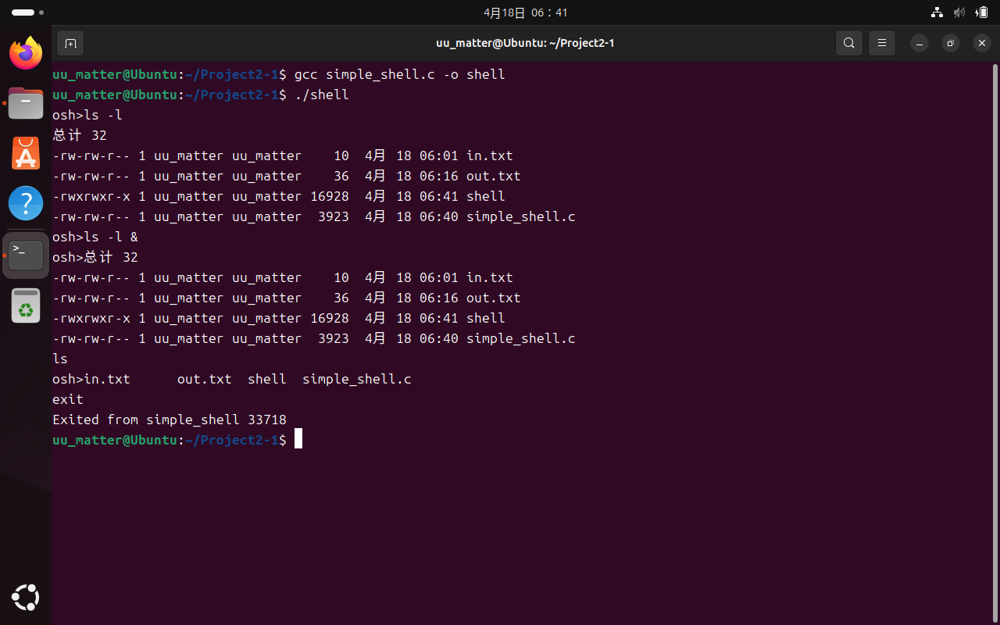
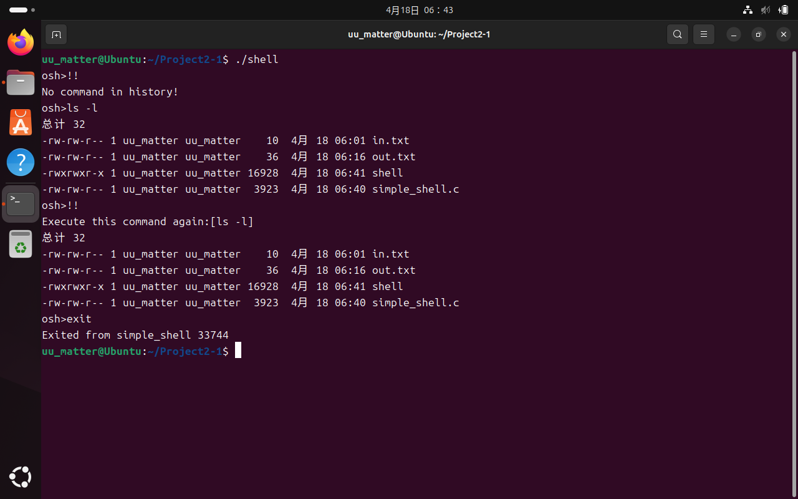
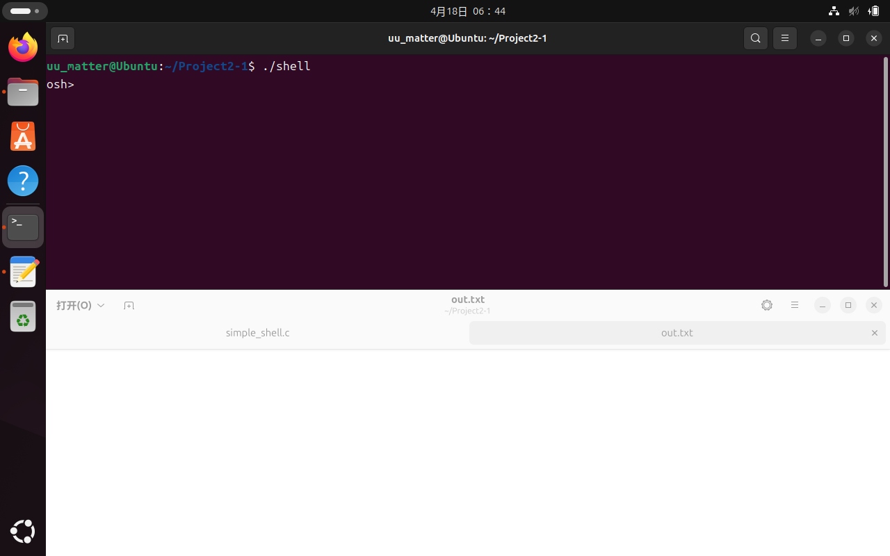
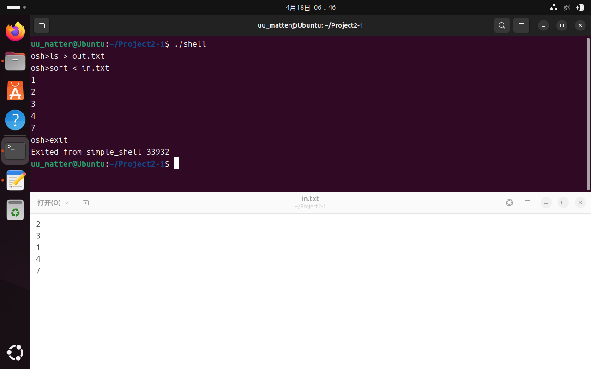
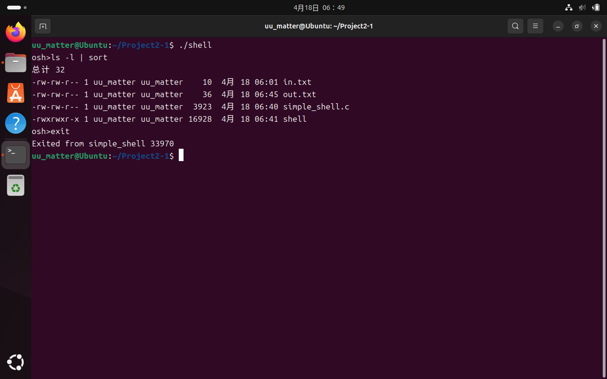
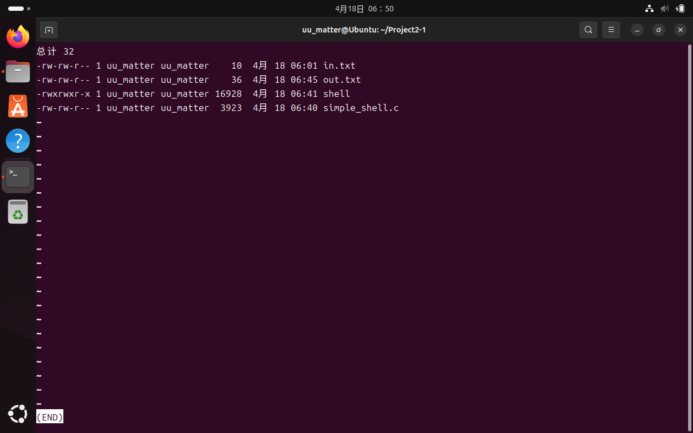
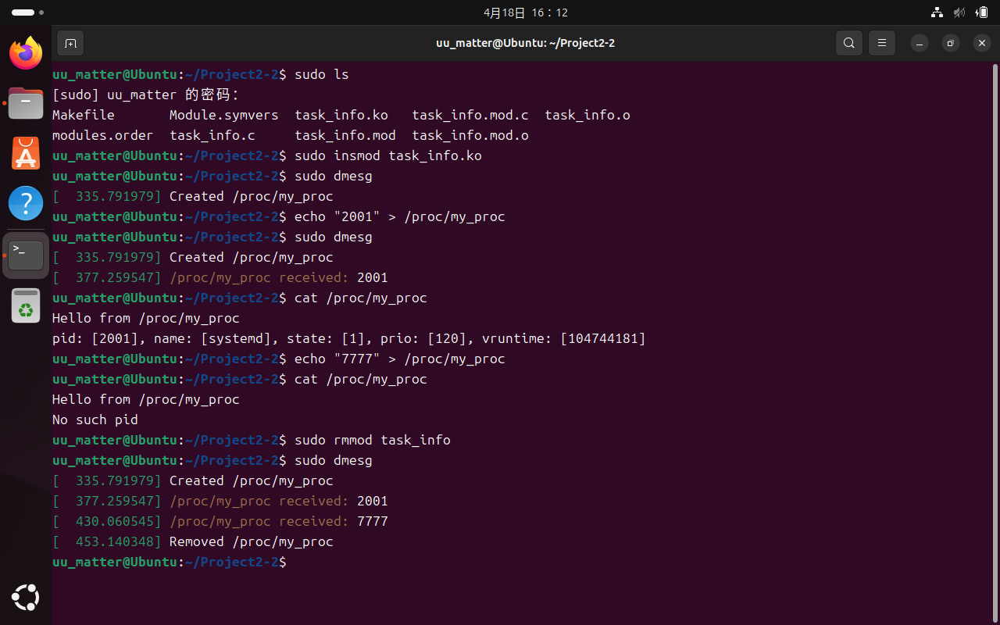

# Project 2 Report

## 2-1 实现shell接口osh>

### 2-1-1 创建子进程并在子进程中执行命令

首先处理`exit`命令以终止shell进程

```c
if (strcmp(input, "exit") == 0)
{
    printf("Exited from simple_shell %d\n", pid);
    should_run = 0;
    break;
}
```

然后通过创建子进程处理其他命令。使用`fork()`函数创建子进程，并用如下结构区分子进程与父进程：

```c
if (pid==0) {}  //child process
else {}         //parent process
```

### 2-1-2 提供历史记录功能

输入为`!!`时检查历史记录，若没有历史记录则报错，若有则执行记录的历史指令；输入不为`!!`时，将当前命令保存在变量`(char*)last`中，并将“有历史记录”的标记`history`设为`true`

```c
if (strcmp(input, "!!") == 0)
{
    if (history)
    {
        printf("Execute this command again:[%s]\n", last);
        strcpy(input, last);
    }
    else
    {
        printf("No command in history!\n");
        continue;
    }
}
else
{
    strcpy(last, input);
    history = true;
}
```

### 2-1-3 允许父子进程通过管道通信

通过`check_for_parallelism(char*)`函数（分割命令产生的子字符串中最后一个字符串是否为`"&"`），判断是否并发

```c
bool check_for_parallelism(char* input)
{
    int len = strlen(input);
    if (len && input[len-1] == '&') return false;
    else return true;
}
```

若非并发则父进程调用`wait(NULL)`等待子进程返回

```c
else if (wait_for_children)
    wait(NULL);
```

并分割命令为子字符串，并抹去表示并发的`"&"`

```c
int devide(char *input, char **args)
{
    int i = 0;
    char* token = strtok(input, " ");
    while (token != NULL)
    {
        args[i] = token;
        token = strtok(NULL, " ");
        i++;
    }
    return i;
}

for (int i = 0; i <= 40; i++)
    args[i] = (char*) malloc(80 * sizeof(char));
int parts = devide(input, args);
for (int i = parts; i <= 40; i++)
{
    free(args[i]);
    args[i] = NULL;
}
```

之后处理通信管道，寻找`"|"`出现的位置

```c
int pipe_token = -1;
for (int i = 0; i < parts; i++)
    if (strcmp(args[i], "|") == 0)
    {
        pipe_token = i;
        break;
    }
```

若含有通道（通道位置标记`pipe_token`默认为`-1`，不为负则表明含有通道），首先处理通道位于`args[0]`和`args[n-1]`的错误情况

```c
if (pipe_token == 0 || pipe_token == parts-1)
{
    printf("Unacceptable pipe usage\n");
    continue;
}
```

创建管道、创建子进程

```c
int fd[2];
pipe(fd);
pid_t pid_pipe = fork();
```

重新分割命令子字符串+执行并进行通信

```c
if (pid_pipe == 0)
{
    for (int i = pipe_token; i < parts; i++) args[i] = NULL;
    close(fd[0]);
    dup2(fd[1], STDOUT_FILENO);
    execvp(args[0], args);
    close(fd[1]);
}
else
{
    wait(NULL);
    for (int i=pipe_token+1; i<parts; i++) args[i-pipe_token-1]=args[i];
    for (int i=parts-pipe_token-1; i<parts; i++) args[i]=NULL;
    close(fd[1]);
    dup2(fd[0], STDIN_FILENO);
    close(fd[0]);
    execvp(args[0], args);
}
```

### 2-1-4 提供输入输出重定向功能

根据此类命令的特点，首先检查子字符串个数是否大于等于3（131行，小于3个子字符串的命令不可能含有重定向），然后检查`args[n-2]`是否为`"<"`或`">"`，若有则进行C标准库的输入输出与文件处理后`execvp()`，若没有则直接`execvp()`

```c
if (parts >= 3)
{
    if (strcmp(args[parts - 2], "<") == 0)
    {
        strcpy(ifile, args[parts - 1]);
        int fd = open(ifile, O_RDONLY);
        if (fd < 0)
        {
            printf("Failed to open file[%s]\n", ifile);
            continue;
        }
        dup2(fd, STDIN_FILENO);
        close(fd);
    }
    if (strcmp(args[parts - 2], ">") == 0)
    {
        strcpy(ofile, args[parts - 1]);
        int fd = open(ofile, O_WRONLY | O_CREAT | O_TRUNC, 0666);
        if (fd < 0)
        {
            printf("Failed to open file[%s]\n", ofile);
            continue;
        }
        dup2(fd, STDOUT_FILENO);
        close(fd);
    }
    args[parts - 2] = NULL;
    args[parts - 1] = NULL;
    parts -= 2;
    execvp(args[0], args);
}
execvp(args[0], args);
```

### 2-1-5 效果图（Screen Shot文件夹下）

异步与同步执行`ls -l`的区别



历史记录功能



执行带有输出重定向的`ls`之前`out.txt`是空的



执行带有输出重定向的`ls`之后`out.txt`含有本路径下的全部文件


执行带有输入重定向的`sort`时命令行终端显示了排序结果



`ls -l`与`sort`的通信



`ls -l`与`less`的通信



## 2-2 任务信息的Linux内核模块

### 2-2-1 proc_read()

`Linux Kernel 5.6+`后不再支持`file_operations`，而是采用了`proc_ops`
其中`.proc_read`为读取`/proc`文件时调用的函数，而`seq_file()`函数会自动调用在`.proc_open = my_proc_open`中注册的`my_proc_show`函数。

`my_proc_open`函数注册`my_proc_show`函数

```c
static int my_proc_open(struct inode *inode, struct file *file)
{
    return single_open(file, my_proc_show, NULL);
}
```

`my_proc_show`函数定义如下，它给出提示信息`Hello from /proc/my_proc`，读取`/proc/my_proc`中的数字作为`pid`，获取对应进程信息并输出

```c
static int my_proc_show(struct seq_file *m, void *v)
{
    seq_printf(m, "Hello from /proc/my_proc\n");
    struct task_struct *tsk = NULL;
    tsk = pid_task(find_vpid(l_pid), PIDTYPE_PID);
    if (tsk == NULL)
    {
        seq_printf(m, "No such pid\n");
        return 0;
    }
    seq_printf(m, "pid:[%d],name:[%s],state:[%u],prio:[%d],vrt:[%llu]\n",
        tsk->pid, tsk->comm, tsk->__state, tsk->prio, tsk->se.vruntime);
    return 0;
}
```

### 2-2-2 proc_write()

不使用`kstrol()`函数，而直接使用`sscanf(data, "%ld", &l_pid);`获取进程pid并存入`long l_pid`，便于`my_proc_show()`获取待查询的`pid`

### 2-2-3 效果图（Screen Shot文件夹下）

如图流程为：插入模块，检验内核缓冲区收到`Created /proc/my_proc`信息提示，将`2001`写入`/proc_my_proc`（说明：`2001`为通过系统监视器查到的`systemd`进程），检验内核缓冲区收到`/proc/my_proc received: 2001`消息，查询`pid == 2001`的进程状态并输出，将`7777`写入`/proc_my_proc`（说明：已确认系统监视器查到的进程中`pid`均不为`7777`），查询`pid == 7777`的进程状态并输出`No such pid`，移除模块，检验内核缓冲区收到`Removed /proc/my_proc`
以上内容表明功能已实现



## 2-3 Bonus: Linux命名通信管道与匿名通信管道的差异性

### 2-3-1 匿名管道（Anonymous Pipe）

**匿名性**：没有文件系统入口，仅通过文件描述符在相关进程间传递。
**单向通信**：数据只能单向流动（一端写，另一端读）。
**临时性**：随进程的创建和销毁而存在（通常由父进程创建，子进程继承）。
**血缘关系**：仅适用于有共同祖先的进程（如父子进程或兄弟进程）。

### 2-3-2 命名管道（Named Pipe）

**具名性**：在文件系统中有一个路径名（如 /tmp/myfifo），可通过路径访问。
**双向性**：支持双向通信（但需自行管理同步，通常仍建议单向使用）。
**持久性**：独立于进程存在（除非显式删除）。
**无血缘要求**：任意进程（即使无亲缘关系）均可通过路径打开管道。
