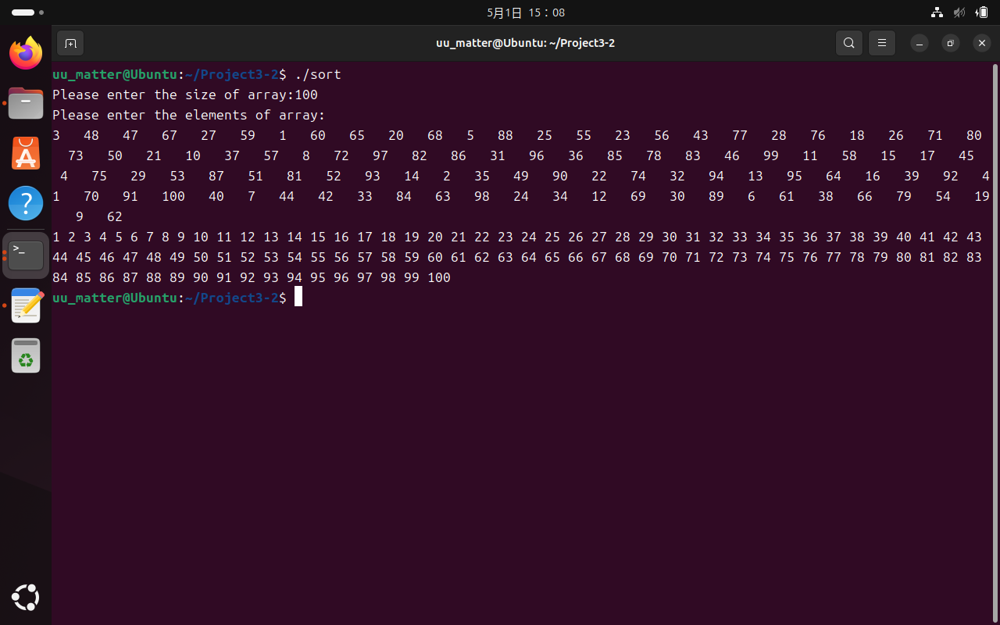
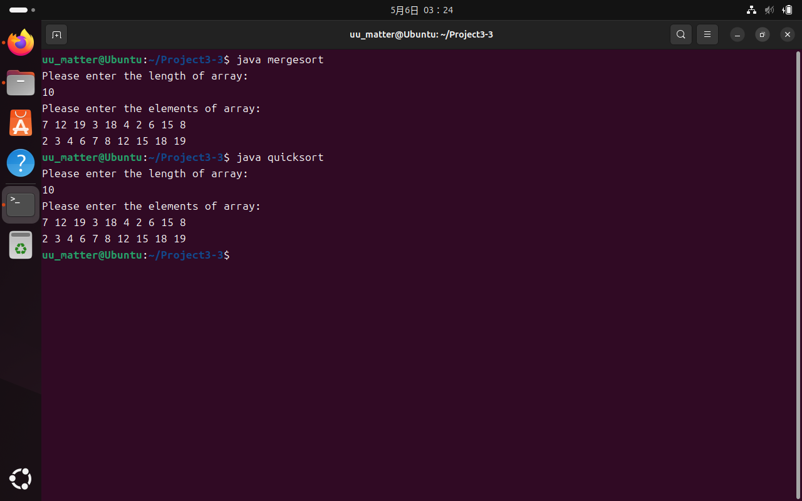

# Project 3 Report

## 3-1 Sudoku check

定义两组全局变量：`int sudoku[9][9]`用于储存待检查数独，`bool row_valid = true, column_valid = true, block_valid = true`分别用于保存行、列、3x3区域的检查结果。

创建11个线程并初始化

```c
pthread_t tid[11];
pthread_attr_t attr;
pthread_attr_init(&attr);
```

1个线程检查行

```c
bool row ()
{
    for (int i = 0; i < 9; i++)
    {
        bool numlib[9] = {false, false, false, false, false, false, false, false, false};
        for (int j = 0; j < 9; j++)
        {
            if (numlib[sudoku[i][j] - 1]) return false;
            else numlib[sudoku[i][j] - 1] = true;
        }
    }
    return true;
}
```

1个线程检查列

```c
bool column ()
{
    for (int i = 0; i < 9; i++)
    {
        bool numlib[9] = {false, false, false, false, false, false, false, false, false};
        for (int j = 0; j < 9; j++)
        {
            if (numlib[sudoku[j][i] - 1]) return false;
            else numlib[sudoku[j][i] - 1] = true;
        }
    }
    return true;
}
```

9个线程分别检查9个3×3方格（先将参数处理为行列编号的二元数对以供传参，并使用下面函数检查3×3方格）

```c
void *block_thread (void *param)
{
    int blocknum = (int)param;
    int row = blocknum / 3;
    int column = blocknum % 3;
    if (!block(row, column)) block_valid = false;
    pthread_exit(0);
}

bool block (int row, int column)
{
    row = row * 3;
    column = column * 3;
    bool numlib[9] = {false, false, false, false, false, false, false, false, false};
    for (int i = row; i < row + 3; i++)
    {
        for (int j = column; j < column + 3; j++)
        {
            if (numlib[sudoku[i][j] - 1]) return false;
            else numlib[sudoku[i][j] - 1] = true;
        }
    }
    return true;
}
```

检查每一行、每一列、每一个3×3方格的方式为：定义一个`bool[9]`保存数字的出现情况，初值为`false`，遇到数字时检查其标记，若为`false`，则改为`true`，表示这个数字已经出现过；若为`true`，说明这个数字出现了2次，则将全局变量中的对应检查结果改为`false`

最后根据3个全局变量`bool row_valid, column_valid, block_valid`的值，汇报结果（行是否有错、列是否有错、方格是否有错、整个数独是否正确）

*补充：检查3x3区域的9个线程均会对变量`block_valid`产生影响，但由于对该变量的可能操作都是赋值，与该变量的当前值无关，所以不会产生线程同步问题*

下列4张图片中分别表示表示正确的情况和3种有错误的情况，可以看到程序均能正确给出判断


## 3-2 Multi-thread MergeSort

创建3个线程

```c
pthread_t tid[3];
pthread_create(&tid[1], NULL, sort, &obj[1]);
pthread_create(&tid[2], NULL, sort, &obj[2]);
pthread_join(tid[1], NULL);
pthread_join(tid[2], NULL);
pthread_create(&tid[0], NULL, merge, &obj[0]);
pthread_join(tid[0], NULL);
```

`tid[1]`和`tid[2]`分别处理数组的前一半和后一半

```c
void *sort(void *param)
{
    struct range *obj = (struct range *)param;
    int begin = obj -> begin;
    int end = obj -> end;
    qsort(before_sort + begin, end - begin + 1, sizeof(int), cmp);
    pthread_exit(0);
}
```

待`tid[1]`和`tid[2]`返回后，`tid[0]`将两个有序子数组归并，即可得到有序数组

```c
void *merge(void *param)
{
    struct range *obj = (struct range *)param;
    int begin = obj -> begin;
    int end = obj -> end;
    int mid = (end - begin + 1) / 2;
    int i = begin, j = mid + 1, k = begin;
    while (i <= mid && j <= end)
    {
        if (before_sort[i] <= before_sort[j])
        {
            after_sort[k] = before_sort[i];
            i++; k++;
        }
        else
        {
            after_sort[k] = before_sort[j];
            j++; k++;
        }
    }
    while (i <= mid)
    {
        after_sort[k] = before_sort[i];
        i++; k++;
    }
    while (j <= end)
    {
        after_sort[k] = before_sort[j];
        j++; k++;
    }
    pthread_exit(0);
}
```

正确性如图所示：



## 3-3 Java Multi-thread Sort

### 3-3-1 Mergesort

根据算法与计算复杂性原理，在数据规模较小时采用插入排序更快

```java
protected void compute()
{
    if (right - left <= 3) insertionsort(data, left, right);
    else 
    {
        int mid = left + (right - left) / 2;
        invokeAll(new mergesort(data, left, mid),
                  new mergesort(data, mid+1, right));
        merge(data, left, mid, right);
    }
}
```

在数组规模小于等于4时（即`(right-left<=3)`时），采用选择排序

```java
private void insertionsort(int[] data, int left, int right)
{
    for (int i = left + 1; i <= right; i++)
    {
        int tmp = data[i];
        int j = i - 1;
        while (j >= left && data[j] > tmp)
        {
            data[j+1] = data[j];
            j--;
        }
        data[j+1] = tmp;
    }
}
```

在数组规模大于4时分裂为2个线程，分别处理前一半数组和后一半数组后，将2个有序数组合并，即可得到有序数组

```java
public void merge(int[] data, int left, int mid, int right)
{
    int[] tmp = new int[right - left + 1];
    int i = left, j = mid + 1, k = 0;
    while(i <= mid && j <= right)
    {
        if (data[i] <= data[j])
        {
            tmp[k] = data[i];
            i++; k++;
        }
        else
        {
            tmp[k] = data[j];
            j++; k++;
        }
    }
    while (i <= mid)
    {
        tmp[k] = data[i];
        i++; k++;
    }
    while (j <= right)
    {
        tmp[k] = data[j];
        j++; k++;
    }
    System.arraycopy(tmp, 0, data, left, right - left + 1);
}
```

### 3-3-2 Quicksort

源文件为`Source Code/Project3-3/quicksort.java`

将`data[mid]`作为中间值，将数组划分为2个子数组

```java
private int partition(int mid)
{
    int pivot = data[mid];
    swap(mid,right);
    int index = left;
    for(int i = left; i < right; i++)
    {
        if (data[i] < pivot)
        {
            swap(i, index);
            index++;
        }
    }
    swap(index, right);
    return index;
}

private void swap(int i, int j)
{
    int tmp = data[i];
    data[i] = data[j];
    data[j] = tmp;
}
```

再采用多线程思想，分别递归处理2个子数组，即可得到有序数组

```java
protected void compute()
{
    if (left < right)
    {
        int mid = left + (right - left) / 2;
        mid = partition(mid);
        invokeAll(new quicksort(data, left, mid - 1),
                  new quicksort(data, mid+1, right));
    }
}
```

正确性如图所示：


