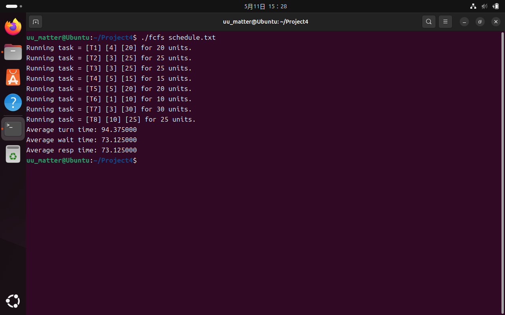
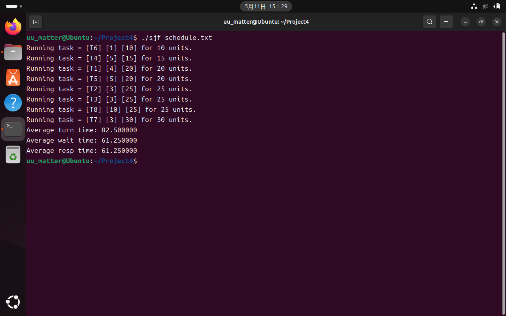
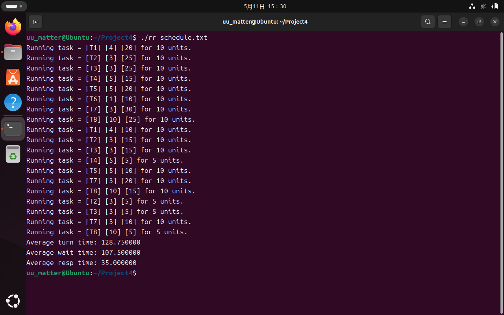
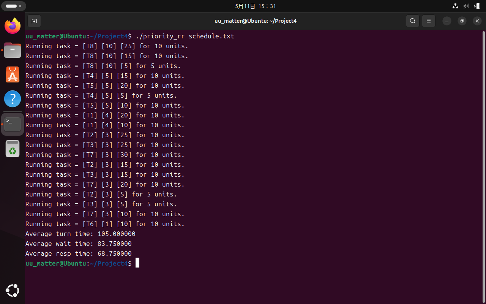

# Project 4 Report

## 4-1 FCFS

FCFS实现比较简单，只需要按入队次序依次执行即可。由于`void add(char *name, int priority, int burst)`函数是将每次入队的任务置于队首，所以每次要选择队尾任务执行。

由于每个任务只执行一次，在每次执行完任务之后，对性能参数进行更新如下：总周转时间要加上任务完成的时刻，总等待时间要加上"任务执行时间×(剩余任务数-1)"，总响应时间要加上任务开始的时刻。

```c
while(true)
{
    if (head == NULL) break;
    struct node *current = head;
    while (current->next != NULL) current = current->next;
    
    run(current->task, current->task->burst);
    
    resp += time;
    time += current->task->burst;
    turn += time;
    wait += current->task->burst * (task_cnt-1);
    
    delete(&head, current->task);
    task_cnt--;
}
```



## 4-2 SJF

SJF的实现与FCFS类似，只需要每次选择最短时间的任务执行即可。对于时间相同的情况，选择队列里的后者(`if`语句的条件中<=的逻辑)，因为处于队列后面意味着先到达。

由于每个任务只执行一次，在每次执行完任务之后，对性能参数进行更新如下：总周转时间要加上任务完成的时刻，总等待时间要加上"任务执行时间×(剩余任务数-1)"，总响应时间要加上任务开始的时刻。

```c
while(true)
{
    if (head == NULL) break;
    struct node *search = head;
    struct node *current = head;
    while (search->next != NULL)
    {
        search = search->next;
        if (search->task->burst <= current->task->burst) current = search;
    }
    
    run(current->task, current->task->burst);
    
    resp += time;
    time += current->task->burst;
    turn += time;
    wait += current->task->burst * (task_cnt-1);
    
    delete(&head, current->task);
    task_cnt--;
}
```



## 4-3 Priority

Priority实现与FCFS也比较类似，只需要每次选择优先级最高的任务执行即可。对于优先级相同的情况，选择队列里的后者(`if`语句的条件中>=的逻辑)，因为处于队列后面意味着先到达。

由于每个任务只执行一次，在每次执行完任务之后，对性能参数进行更新如下：总周转时间要加上任务完成的时刻，总等待时间要加上"任务执行时间×(剩余任务数-1)"，总响应时间要加上任务开始的时刻。

```c
while(true)
{
    if (head == NULL) break;
    struct node *search = head;
    struct node *current = head;
    while (search->next != NULL)
    {
        search = search->next;
        if (search->task->priority >= current->task->priority) current = search;
    }
    
    run(current->task, current->task->burst);
    
    resp += time;
    time += current->task->burst;
    turn += time;
    wait += current->task->burst * (task_cnt-1);
    
    delete(&head, current->task);
    task_cnt--;
}
```


## 4-4 RR

RR的实现与前三者有所不同，因为每个任务不止执行一次。每次仍然选择队尾任务执行，然后根据剩余时间情况分别处理

```c
while(true)
{
    if (head == NULL) break;
    struct node *current = head;
    while (current->next != NULL) current = current->next;
    
    if (current->task->burst <= 10) {/* Execute till end */}
    else {/* Execute 10 units */}
}
```

剩余时间小于等于10时，执行该任务直到完成

在每次执行完任务之后，对性能参数进行更新如下：总周转时间要加上任务完成的时刻，总等待时间要加上"任务执行时间×(剩余任务数-1)"，总响应时间只要加上前n次执行任务的开始时刻(n为初始化任务列表完成时的总任务数)

```c
run(current->task, current->task->burst);
if (i < total_task_cnt)
{
    resp += time;
    i++;
}
time += current->task->burst;
turn += time;
wait += current->task->burst * (task_cnt-1);
delete(&head, current->task);
task_cnt--;
```

剩余时间大于10时，执行该任务10个时间单位，并将该任务从队尾删除后，以`burst-=10`的状态加回到队首

在每次执行完任务之后，对性能参数进行更新如下：总周转时间不变(因为此时执行的任务不会执行完)，总等待时间要加上"任务执行时间×(剩余任务数-1)"，总响应时间只要加上前n次执行任务的开始时刻(n为初始化任务列表完成时的总任务数)

```c
run(current->task, 10);
if (i < total_task_cnt)
{
    resp += time;
    i++;
}
time += 10;
wait += 10 * (task_cnt-1);
char *name = current->task->name;
int priority = current->task->priority;
int burst = current->task->burst - 10;
task_cnt--;
delete(&head, current->task);
add(name, priority, burst);
```



## 4-5 Priority_RR

Priority_RR的实现最为复杂，需要设立多个队列对应不同优先级，之后依次对每个队列进行RR调度。

在每次执行完任务之后，对性能参数进行更新如下：总周转时间要加上任务完成的时刻，总等待时间要加上"任务执行时间×(剩余任务数-1)"，总响应时间的计算比较复杂，需要在对每个队列调度时，只计算前n个突发的开始时刻(n为该队列初始化完成时的任务个数)。

```c
struct node* head[121];

for(int i = 120; i >= 0; i--)
{
    int j = 0;
    while(true)
    {
        if (head[i] == NULL) break;
        int current_task_cnt = queue[i];
        struct node *current = head[i];
        while (current->next != NULL) current = current->next;
        
        if (current->task->burst <= 10)
        {
            run(current->task, current->task->burst);
            if (j < current_task_cnt)
            {
                resp += time;
                j++;
            }
            time += current->task->burst;
            turn += time;
            wait += current->task->burst * (task_cnt-1);
            delete(&head[i], current->task);
            queue[current->task->priority]--;
            task_cnt--;
        }
        else
        {
            run(current->task, 10);
            if (j < current_task_cnt)
            {
                resp += time;
                j++;
            }
            time += 10;
            wait += 10 * (task_cnt-1);
            char *name = current->task->name;
            int priority = current->task->priority;
            int burst = current->task->burst - 10;
            queue[current->task->priority]--;
            task_cnt--;
            delete(&head[i], current->task);
            add(name, priority, burst);
        }
    }
}
```



## 4-6 Bonus 1：tid原子操作

声明全局变量`int tid_value = 0;`，此后只需要在`void add(char *name, int priority, int burst)`函数实现时，设置`tid`时采用原子操作`new_task->tid = __sync_fetch_and_add(&tid_value,1);`即可实现互斥

## 4-7 Bonus 2: 调度算法评估

周转时间、等待时间、响应时间的计算已均在算法实现中给出，测试用例为：

```c
T1, 4, 20
T2, 3, 25
T3, 3, 25
T4, 5, 15
T5, 5, 20
T6, 1, 10
T7, 3, 30
T8, 10, 25
```
