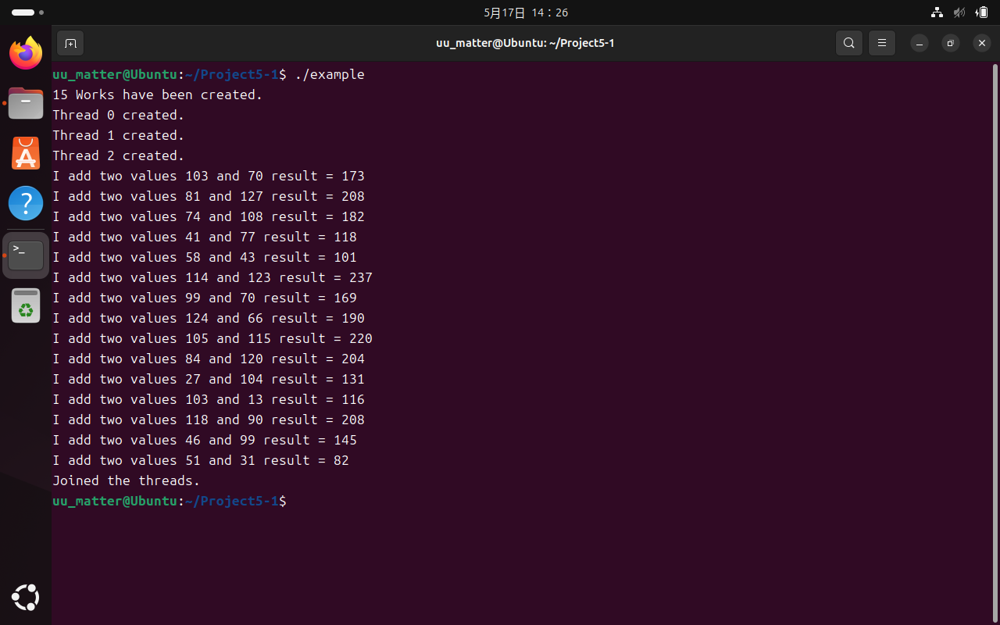
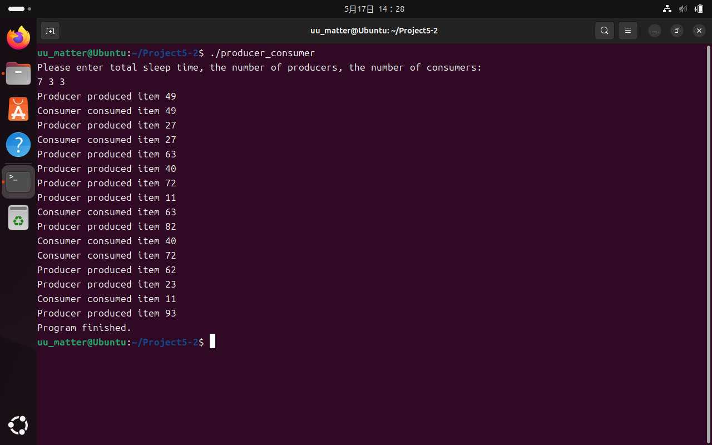

# Project 5 Report

## 5-1 Pthread API 线程池

### `threadpool.h`和`threadpool.c`

全局变量：单链表实现任务队列的抽象任务结构体和任务结点结构体，以及结束任务标记`close`；

```c
bool close = false;
struct task
{
    void (*function)(void *p);
    void *data;
};
struct task_node
{
    struct task to_do;
    struct task_node *next;
};
struct task_node *head, *tail;
```

`Pthread API`的使用和信号量：

```c
pthread_t bee[3];
pthread_mutex_t queue_mutex = PTHREAD_MUTEX_INITIALIZER;
sem_t sem;
```

入队函数`int enqueue()`实现：

```c
int enqueue(struct task t) 
{
    pthread_mutex_lock(&queue_mutex);
    tail->next = (struct task_node*)malloc(sizeof(struct task_node));
    if (tail->next == NULL)
    {
        printf("Error: Queue is full!\n");
        pthread_mutex_unlock(&queue_mutex);
        return 1;
    }
    tail = tail->next;
    tail->to_do = t;
    pthread_mutex_unlock(&queue_mutex);
    return 0;
}
```

出队函数`struct task dequeue()`实现：

```c
struct task dequeue() 
{
    pthread_mutex_lock(&queue_mutex);
    if (head == tail)
    {
        printf("Error: Queue is empty!\n");
        pthread_mutex_unlock(&queue_mutex);
        exit(0);
    }
    struct task_node *del = head;
    head = head->next;
    free(del);
    pthread_mutex_unlock(&queue_mutex);
    return head->to_do;
}
```

每个线程的主函数`void *worker(void *param)`，以及要执行的任务`void execute(void (*somefunction)(void *p), void *p)`：

```c
void *worker(void *param)
{
    static struct task to_execute;
    while (true)
    {
        sem_wait(&sem);
        if (close) pthread_exit(0);
        to_execute = dequeue();
        execute(to_execute.function, to_execute.data);
    }
    pthread_exit(0);
}

void execute(void (*somefunction)(void *p), void *p)
{
    (*somefunction)(p);
}
```

向线程池提交任务函数`int pool_submit(void (*somefunction)(void *p), void *p)`：

```c
int pool_submit(void (*somefunction)(void *p), void *p)
{
    struct task to_do;
    to_do.function = somefunction;
    to_do.data = p;
    enqueue(to_do);
    sem_post(&sem);
    return 0;
}
```

线程池初始化函数`void pool_shutdown(void)`：

```c
void pool_init(void)
{
    head = (struct task_node*)malloc(sizeof(struct task_node));
    tail = head;
    sem_init(&sem, 0, 0);
    for (int i = 0; i < 3; i++)
    {
        pthread_create(&bee[3],NULL,worker,NULL);
        printf("Thread %d created.\n", i);
    }
}
```

关闭线程池函数`void pool_shutdown(void)`：

```c
void pool_shutdown(void)
{
    close = true;
    for (int i = 0; i < 3; i++) sem_post(&sem);
    for (int i = 0; i < 3; i++) pthread_join(bee[i], NULL);
    printf("Joined the threads.\n");
    sem_destroy(&sem);
    pthread_mutex_destroy(&queue_mutex);
}
```

### `client.c`

任务函数`void add(void* param)`：

```c
void add(void *param)
{
    struct data *temp;
    temp = (struct data*)param;
    printf("I add two values %d and %d result = %d\n",
            temp->a, temp->b, temp->a + temp->b);
}
```

主函数：

```c
int main(void)
{
    struct data work[15];
    for(int i = 0; i < 15; i++)
    {
        work[i].a = rand() % 128;
        work[i].b = rand() % 128;
    }
    printf("15 Works have been created.\n");
    pool_init();
    for(int i = 0; i < 15; i++) pool_submit(&add,&work[i]);
    sleep(1);
    pool_shutdown();

    return 0;
}
```

### 分析执行过程

从`main`函数开始总体来看，执行过程为：
1.申请任务参数列表并初始化，这里创建了15个加法函数；
2.初始化线程池：
(1)创建首尾结点，为首结点申请空间，且首结点仅作为队列入口，不存放数据(哨兵元素)；
(2)初始化信号量；
(3)根据指定的线程池容量创建线程；
3.向线程池提交任务：
(1)为线程函数准备参数，这里的参数为抽象任务结构体，而这个结构体又包含：要调用的函数及其参数；
(2)将创建好的抽象任务结构体入队；
(3)如果有，唤醒在等待分配任务的线程，令其执行任务；
4.关闭线程池：
(1)将结束任务标记的全局变量设为`true`，线程收到该标记后即退出；
(2)依次唤醒每个线程，每个线程收到该标记后会退出；
(3)析构信号量和互斥锁；
5.退出。

从每个线程角度看，执行过程为(无限循环的循环体内容)：
1.检查信号量，判断任务队列是否为空，从而决定是否要等待；
2.如果无需等待，检查退出标记，从而决定是否结束线程；
3.如果线程不结束，则从任务队列中取出一个任务并执行。

效果如图：


## 5-2 生产者消费者问题

### `buffer.h`和`buffer.c`

全局变量：缓冲区及其首尾指针，互斥锁：

```c
int head, tail;
buffer_item buffer[5];
pthread_mutex_t mutex;
```

缓冲区初始化函数`int buffer_init()`：

```c
int buffer_init()
{
    head = 0;
    tail = 0;
    pthread_mutex_init(&mutex, NULL);
    if (head == 0 && tail == 0) return 0;
    else return -1;
}
```

向缓冲区写入数据`int insert_item(buffer_item item)`：
标记`status`的值表示存数据是否成功；
存数据过程移动尾指针，写入数据，并修改标记表示写入成功；
写入成功则返回0，否则返回-1：

```c
int insert_item(buffer_item item)
{
    bool status = false;
    pthread_mutex_lock(&mutex);
    if ((tail+1) % 5 != head)
    {
        tail = (tail+1) % 5;
        buffer[tail] = item;
        status = true;
    }
    pthread_mutex_unlock(&mutex);
    if (status) return 0;
    else return 1;
}
```

从缓冲区读取数据`int remove_item(buffer_item *item)`：
标记`status`的值表示取数据是否成功；
取数据过程移动头指针，取出数据，并修改标记表示取出成功；
取出成功则返回0，否则返回-1：

```c
int remove_item(buffer_item *item)
{
    bool status = false;
    pthread_mutex_lock(&mutex);
    if (head != tail)
    {
        head = (head+1) % 5;
        *item = buffer[head];
        status = true;
    }
    pthread_mutex_unlock(&mutex);
    if (status) return 0;
    else return 1;
}
```

### `producer_consumer.c`

生产者线程`void *producer(void *param)`：
休眠随机时间，模拟其他环境中可能遇到的突发时间长短不定的特点；
对临界区的进入和离开，采用互斥操作`wait(empty)`和`signal(full)`；
在临界区内，若主进程要求停止，则进程退出；
进程没有退出时，若存数据不成功则报错，若存数据成功则产生存入数据的信息：

```c
void *producer(void *param)
{
    buffer_item item;
    while (true)
    {
        sleep(rand() % 5);
        item = rand() % 100;
        sem_wait(&empty);
        if (closedown) break;
        if (insert_item(item))
        {
            printf("Producer thread error!\n");
            break;
        }
        else printf("Producer produced item %d\n", item);
        sem_post(&full);
    }
}
```

消费者线程`void *consumer(void *param)`：
休眠随机时间，模拟其他环境中可能遇到的突发时间长短不定的特点；
对临界区的进入和离开，采用互斥操作`wait(full)`和`signal(empty)`；
在临界区内，若主进程要求停止，则进程退出；
进程没有退出时，若取数据不成功则报错，若取数据成功则产生取出数据的信息：

```c
void *consumer(void *param)
{
    buffer_item item;
    while (true)
    {
        sleep(rand() % 5);
        item = rand() % 100;
        sem_wait(&full);
        if (closedown) break;
        if (remove_item(&item))
        {
            printf("Consumer thread error!\n");
            break;
        }
        else printf("Consumer consumed item %d\n", item);
        sem_post(&empty);
    }
}
```

主函数：
设定3个变量：主线程时间，生产者线程数量，消费者线程数量，其值由用户指定；
初始化缓冲区，缓冲区空信号量，缓冲区满信号量；
2个`for`循环语句块分别创建生产者线程和消费者线程；
主线程进入休眠状态以观察生产者线程和消费者线程活动；
主线程休眠结束后，修改关闭线程标记，并强制释放信号量以唤醒所有线程并令其结束；
报告主进程结束信息：

```c
int main()
{
    int sleep_time;
    int producer_counts;
    int consumer_counts;
    printf("Please enter sleep time, the number of producers, the number of consumers:\n");
    scanf("%d %d %d", &sleep_time, &producer_counts, &consumer_counts);
    buffer_init();
    sem_init(&empty, 0, 4);
    sem_init(&full, 0, 0);
    for (int i = 0; i < producer_counts; i++)
    {
        pthread_t tid;
        pthread_attr_t attr;
        pthread_attr_init(&attr);
        pthread_create(&tid, &attr, producer, NULL);
    }
    for (int i = 0; i < consumer_counts; i++)
    {
        pthread_t tid;
        pthread_attr_t attr;
        pthread_attr_init(&attr);
        pthread_create(&tid, &attr, consumer, NULL);
    }
    sleep(sleep_time);
    closedown = true;
    for (int i = 0; i < producer_counts; i++) sem_post(&empty);
    for (int i = 0; i < consumer_counts; i++) sem_post(&full);
    printf("Program finished.\n");
    return 0;
}
```

效果如图：


## 5-3 Bonus:线程池核心线程数量设置的影响与优化策略

### 5-3-1 核心线程数量不当的影响

#### 核心线程数量过大的问题

- **资源浪费**：每个线程都会占用内存(栈空间)和CPU资源，过多线程会导致资源争用；
- **上下文切换开销增加**：线程数量超过CPU核心数时，频繁的线程切换会降低性能；
- **系统稳定性下降**：可能耗尽系统资源(如内存、文件句柄等)，导致OOM或系统崩溃；

#### 核心线程数量过小的问题

- **CPU利用率不足**：无法充分利用多核CPU的计算能力；
- **吞吐量降低**：任务排队等待，响应时间变长；
- **任务堆积**：当任务到达速率高于处理速率时，可能导致队列溢出；

### 5-3-2 合理设置核心线程数量的方法

#### 考虑因素

##### 任务类型

- CPU密集型：建议线程数 ≈ CPU核心数(或核心数+1)
- I/O密集型：线程数可以更多，因为线程会有大量等待时间
- 混合型：根据比例调整

##### 硬件资源

- CPU核心数
- 内存容量
- 系统其他资源限制

##### 任务特性

- 任务到达频率
- 单个任务执行时间
- 任务优先级要求

#### 优化方法

- **基准测试**：通过压力测试找到最优值
- **动态调整**：使用可配置的线程池，根据监控数据动态调整
- **监控机制**：实现线程池监控，观察任务排队时间、拒绝率等指标
- **使用现有工具**：如C/C++的`Pthread`，Java的`ThreadPoolExecutor`，或更高级的ForkJoinPool
