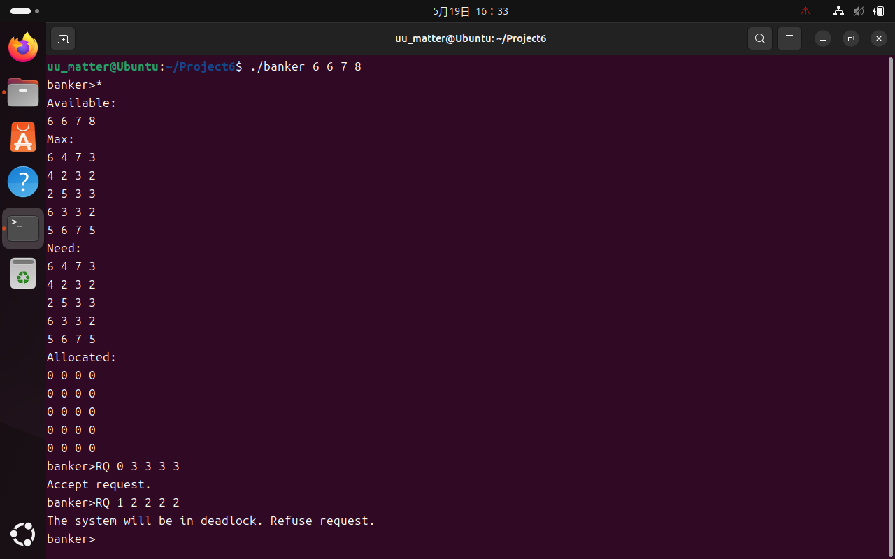
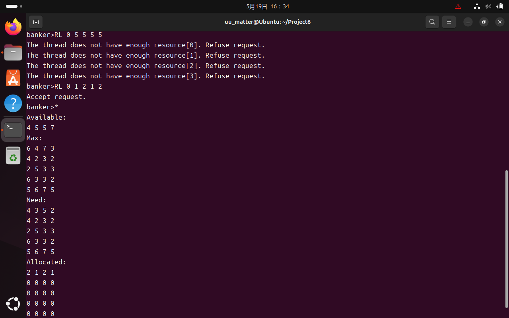

# Project 6 Report: Banker Algorithm

## 全局变量声明

根据银行家算法，声明4个数组：
一维数组`available`：目前可用资源向量
二维数组`max`：每个进程占用资源最大数量的矩阵
二维数组`need`：每个进程仍然需要资源数量的矩阵
二维数组`allocation`：每个进程已得到资源数量的矩阵
满足`max == need + allocation`

```c
int available[4];
int max[5][4];
int need[5][4];
int allocation[5][4];
```

## 全局变量初始化：`main`函数第1部分

首先在执行程序的命令行`./allocator 6 6 7 8`中读取4种资源的最大数量，如果接收到的参数不为5个则报错并退出，如果接收到的参数为5个则初始化`available`数组；然后从文件中读取`max`数组的值，并用`max`数组初始化`need`数组

```c
if (argc != 5)
{
    printf("Unacceptable usage!\n");
    return -1;
}
for (int i=0; i<4; i++) available[i] = atoi(argv[i+1]);
FILE *f;
f = fopen("input.txt","r");
for (int i=0; i<5; i++) for (int j=0; j<4; j++) fscanf(f, "%d", &max[i][j]);
for (int i=0; i<5; i++) for (int j=0; j<4; j++) need[i][j] = max[i][j];
fclose(f);
```

## 命令处理框架：`main`函数第2部分

声明字符串`input`以接受命令

命令处理框架中，首先给出提示符`banker>`提示用户输入命令，刷新缓冲区并接收命令到字符串`input`；若命令为`exit`则退出循环，并给出提示信息；若命令为`*`则调用`print_status()`函数输出当前状态；若不为以上命令，则为`RQ`或`RL`命令，需要先对命令加以分割

处理`RQ`和`RL`命令的过程是：声明字符串指针数组`param`以保存命令行参数，并调用`divide(input, param)`函数对输入命令加以分割；根据分割得到的第一个参数部分判断为`RQ`或`RL`命令，并根据命令调用`apply_resource(param)`和`release_resource(param)`加以操作

```c
char *input = (char*)malloc(100*sizeof(char));
while (true)
{
    printf("banker>");
    fflush(stdout);
    fgets(input, 100, stdin);
    input[strlen(input) - 1] = '\0';
    if (strcmp(input, "exit") == 0) break;
    if (strcmp(input, "*") == 0)
    {
        print_status();
        continue;
    }
    char *param[10];
    for (int i=0; i<10; i++) param[i] = (char*)malloc(10*sizeof(char));
    divide(input, param);
    if (strcmp(param[0], "RQ") == 0) apply_resource(param);
    if (strcmp(param[0], "RL") == 0) release_resource(param);
}
printf("Exited from banker.\n");
```

需要实现的函数有：
`void print_status()`：输出当前状态
`void divide(char *input, char **param)`：分割命令，得到参数
`bool safe()`：判断当前状态是否可能含有死锁
`void apply_resource(char **param)`：进程申请资源处理
`void release_resource(char **param)`：进程释放资源处理

## 输出当前状态：`print_status()`函数

`print_status()`函数的实现比较简单，只需要依次输出数组`available[]`，`max[][]`，`need[][]`，`allocation[][]`的值即可

```c
void print_status()
{
    printf("Available:\n");
    for (int i=0; i<4; i++) printf("%d ", available[i]);
    printf("\n");
    printf("Max:\n");
    for (int i=0; i<5; i++)
    {
        for (int j=0; j<4; j++) printf("%d ", max[i][j]);
        printf("\n");
    }
    printf("Need:\n");
    for (int i=0; i<5; i++)
    {
        for (int j=0; j<4; j++) printf("%d ", need[i][j]);
        printf("\n");
    }
    printf("Allocated:\n");
    for (int i=0; i<5; i++)
    {
        for (int j = 0; j<4; j++) printf("%d ", allocation[i][j]);
        printf("\n");
    }
}
```

## 命令分割：`divide(char*, char**)`函数

与Project 2中分割命令函数实现方式类似，不再赘述：

```c
void divide(char *input, char **param)
{
    int i = 0;
    char *token = strtok(input, " ");
    while (token != NULL)
    {
        param[i] = token;
        token = strtok(NULL, " ");
        i++;
    }
    param[i] = NULL;
}
```

## 死锁检测：`safe()`函数

由于不能修改实际状态，因此用`tmp`数组临时存储死锁检测过程中的可用资源数量；用`finish`数组表示死锁检测过程中进程的完成情况

检测方式为：不断扫描各个进程，在每次遍历进程的过程中设置`progressive`变量，初始化为`false`，表示本轮扫描过程中是否有进展；扫描每个进程时，如果各类资源可用数量大于需求数量，则将进程执行并释放相关资源，并设置`progressive = true`；当没有进程可取得进展时退出扫描循环，之后检测各进程是否均已完成；如果有任何进程未完成，则函数返回`false`，否则返回`true`

```c
bool safe()
{
    int tmp[4];
    bool finish[5];
    for (int i=0; i<4; i++) tmp[i] = available[i];
    for (int i=0; i<5; i++) finish[i] = false;
    bool progressive = true;
    while (progressive)
    {
        progressive = false;
        for (int i=0; i<5; i++)
        {
            bool execute = true;
            for (int j=0; j<4; j++) if (tmp[j]<need[i][j]) execute = false;
            if (execute && !finish[i])
            {
                for (int j=0; j<4; j++) tmp[j] = tmp[j] + allocation[i][j];
                progressive = true;
                finish[i] = true;
            }
        }
    }
    for (int i=0; i<5; i++) if (!finish[i]) return false;
    return true;
}
```

## 资源申请：`apply_resource(char**)`函数

首先处理参数得到进程号和要申请的资源，然后检测2项：申请的资源是否超过了`need`，申请资源是否超过了`available`；若任何一项超过，则拒绝申请并返回，无需后续处理；若未超过则要根据情况检测死锁

假设能够接受，对接受的情况调用`safe()`函数检测安全状态，若不安全则报错并复原未为进程分配资源的状态，若安全则接受申请并不做处理以维持分配资源后的状态

```c
void apply_resource(char **param)
{
    int tid = atoi(param[1]);
    int apply[4];
    for (int i=0; i<4; i++) apply[i] = atoi(param[i+2]);
    bool accept = true;
    for (int i=0; i<4; i++)
    {
        if (apply[i] > need[tid][i]) 
        {
            printf("Total possession[%d] will exceed maximum. Refuse request.\n", i);
            accept = false;
        }
        if (apply[i] > available[i])
        {
            printf("Current available[%d] is not enough. Refuse request.\n", i);
            accept = false;
        }
    }
    if (!accept) return;
    for (int i=0; i<4; i++)
    {
        available[i] = available[i] - apply[i];
        allocation[tid][i] = allocation[tid][i] + apply[i];
        need[tid][i] = need[tid][i] - apply[i];
    }
    accept = safe();
    if (!accept)
    {
        printf("The system will be in deadlock. Refuse request.\n");
        for (int i=0; i<4; i++)
        {
            available[i] = available[i] + apply[i];
            allocation[tid][i] = allocation[tid][i] - apply[i];
            need[tid][i] = need[tid][i] + apply[i];
        }
    }
    else printf("Accept request.\n");
}
```

## 资源释放：`release_resource(char**)`函数

本函数实现也比较简单，只需检测进程释放的资源是否超过了已为进程分配的资源数量即可，若未超过则更新全局变量值，若超过则报错并返回

```c
void release_resource(char **param)
{
    int tid = atoi(param[1]);
    int apply[4];
    for (int i=0; i<4; i++) apply[i] = atoi(param[i+2]);
    bool accept = true;
    for (int i=0; i<4; i++)
        if (allocation[tid][i] < apply[i])
        {
            printf("The thread does not have enough resource[%d]. Refuse request.\n", i);
            accept = false;
        }
    if (accept)
    {
        printf("Accept request.\n");
        for (int i=0; i<4; i++)
        {
            available[i] = available[i] + apply[i];
            allocation[tid][i] = allocation[tid][i] - apply[i];
            need[tid][i] = need[tid][i] + apply[i];
        }
    }
}
```

## 效果展示

初始化可用资源数量分别为6 6 7 8
验证输出当前状态、合理申请资源、申请资源将导致死锁等功能：



验证非法释放资源、合理释放资源等功能：


