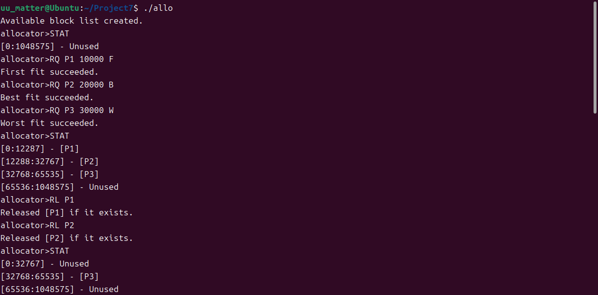

# Project 7 Report：allocator

## 7-1 内存分配实现`allocator.c`

### 全局变量声明

定义结构体`block`用于存放块的信息：起始块号`start`，终止块号`end`，是否被使用`used`，使用该块的进程名`pid`；
定义结构体`node`为双链表的结点：指向`block`的指针表示孔的内容，指向前一个结点的指针`prior`，指向后一个结点的指针`next`；
定义2个指向`node`的指针`head`和`tail`，分别表示双链表的头尾结点；
`allocator.c`中，内存块按双链表方式组织，每个结点包含1个孔，且链接顺序为内存地址的先后顺序

```c
struct block{
    int start;
    int end;
    bool used;
    char pid[10];
};
struct node{
    struct block *hole;
    struct node *prior;
    struct node *next;
};
struct node *head;
struct node *tail;
```

### 请求处理框架：`main`函数

`main`函数的任务为：初始化双链表，声明命令所需的各种变量，并针对用户输入，调用不同的函数处理用户请求
处理命令循环为，首先给出`allocator>`提示用户输入命令。
当命令为`exit`时，退出处理命令循环；
当命令为`STAT`时，打印当前内存状态；
当命令为`RQ`时，从命令获取进程名、大小、分配策略，并根据分配策略参数调用不同函数处理内存分配申请；
当命令为`RL`时，从命令获取进程名，并调用函数释放内存

```c
init();
char command[10];
char pid[10];
int size;
char method;
while(true)
{
    printf("allocator>");
    scanf("%s", command);
    if (strcmp("exit", command) == 0) break;
    if (strcmp("STAT", command) == 0) print_status();
    else if (strcmp("RQ", command) == 0)
    {
        scanf("%s %d %c", pid, &size, &method);
        size = size / 4096 + (size%4096!=0);
        if (method == 'F') first_fit(pid, size);
        if (method == 'B') best_fit(pid, size);
        if (method == 'W') worst_fit(pid, size);
    }
    else if (strcmp("RL", command) == 0)
    {
        scanf("%s", pid);
        release(pid);
    }
}
printf("Exited from allocator.\n");
return 0;
```

需要实现的函数有：
`void init()`：初始化内存分配双链表；
`void print_status()`：打印当前内存分配状态；
`void insert_process(struct node*, char*, int)`：找到为进程分配内存的孔后，将进程内存插入该孔；
`void first_fit(char*, int)`：首次适应算法实现
`void best_fit(char*, int)`：最优适应算法实现
`void worst_fit(char*, int)`：最差适应算法实现
`void release(char*)`：释放进程内存算法实现

### 初始化：`init()`函数

初始化即设置`head`和`tail`的状态（仅作为哨兵，不存放孔），并申请一个结点`whole`，初始化内部的`hole`指针为整个内存组成的孔（0~255块）；之后分别设置3个结点的2条链即可

```c
void init()
{
    head = (struct node*)malloc(sizeof(struct node));
    tail = (struct node*)malloc(sizeof(struct node));
    head->hole = NULL;
    tail->hole = NULL;
    struct node *whole = (struct node*)malloc(sizeof(struct node));
    whole->hole = (struct block*)malloc(sizeof(struct block));
    whole->hole->start = 0;
    whole->hole->end = 255;
    whole->hole->used = false;
    whole->prior = head;
    whole->next = tail;
    
    head->prior = NULL;
    head->next = whole;
    tail->prior = whole;
    tail->next = NULL;
    
    printf("Available block list created.\n");
}
```

### 输出当前状态：`print_status()`函数

输出状态函数实现比较简单，只需要活指针从头结点的下个结点开始，每次输出当前结点的孔信息，输出完成后向后移动，直到活指针到达尾结点即可
打印当前结点的孔信息：首先输出孔的起止块号；之后若孔信息中的`used`为`false`，则输出`Unused`，否则输出占有孔的进程的名称`tmp->hole->pid`

```c
void print_status()
{
    struct node *tmp = head->next;
    while (tmp != tail)
    {
        if(tmp->hole->used) printf("[%d:%d] - [%s]\n",
        tmp->hole->start*4096, tmp->hole->end*4096+4095, tmp->hole->pid);
        else printf("[%d:%d] - Unused\n",
        tmp->hole->start*4096, tmp->hole->end*4096+4095);
        tmp = tmp->next;
    }
}
```

### 插入进程：`insert_process(struct node*, char*, int)`函数

参数列表中，`tmp`是即将插入的孔，`pid`是占有孔的进程名，`size`是为进程分配内存的块数；
首先申请一个结点存放进程占有孔信息，起始块号为`tmp`的孔的起始块号，终止块号可由起始块号和内存大小计算得到`allo->hole->end = tmp->hole->start + size - 1`，使用状态为`true`，进程名则从输入参数`pid`复制得到；
信息维护完成后，将其插入双链表中`tmp`结点之前，并更新`tmp`的起始块号为`allo`的终止块号+1，此时若`tmp`的起始块号大于终止块号，说明该孔已被进程全部占有，因此要从双链表中删除`tmp`结点

```c
void insert_process(struct node* tmp, char *pid, int size)
{
    struct node* allo = (struct node*)malloc(sizeof(struct node));
    allo->hole = (struct block*)malloc(sizeof(struct block));
    allo->hole->start = tmp->hole->start;
    allo->hole->end = tmp->hole->start + size - 1;
    allo->hole->used = true;
    strcpy(allo->hole->pid, pid);
    allo->prior = tmp->prior;
    allo->next = tmp;
    tmp->hole->start = allo->hole->end + 1;
    tmp->prior = allo;
    allo->prior->next = allo;
    if (tmp->hole->start > tmp->hole->end)
    {
        tmp->prior->next = tmp->next;
        tmp->next->prior = tmp->prior;
        free(tmp->hole);
        free(tmp);
    }
}
```

### 首次适应：`first_fit(char*, int)`函数

首次适应实现比较简单，只需从头结点的下一个结点开始，寻找未被占用且足够大的第一个孔，或者到达尾结点；如果到达尾结点，说明所有未被占用的块均不足以为进程分配，输出报错信息

```c
void first_fit(char *pid, int size)
{
    struct node *tmp = head->next;
    int tmp_size = 0;
    while (tmp != tail)
    {
        tmp_size = tmp->hole->end - tmp->hole->start + 1;
        if (!tmp->hole->used && size <= tmp_size)
        {
            insert_process(tmp, pid, size);
            printf("First fit succeeded.\n");
            break;
        }
        else tmp = tmp->next;
    }
    if (tmp == tail) printf("First fit failed.\n");
}
```

### 最优适应：`best_fit(char*, int)`函数

最优适应则是在首次适应的基础上，遍历全部结点，每次找到未占用、足够大、比先前保存的最小孔更小的孔时，更新插入目标；
最后根据保存结点的情况，若为空结点，则说明所有孔都不够大，输出报错信息；否则将进程插入目标孔

```c
void best_fit(char *pid, int size)
{
    struct node *tmp = head->next;
    struct node *cur = NULL;
    int tmp_size = 0;
    int smallest = 1048576;
    while (tmp != tail)
    {
        tmp_size = tmp->hole->end - tmp->hole->start + 1;
        if (!tmp->hole->used && size <= tmp_size && smallest >= tmp_size)
        {
            cur = tmp;
            smallest = tmp_size;
        }
        tmp = tmp->next;
    }
    if (!cur) printf("Best fit failed.\n");
    else
    {
        insert_process(cur, pid, size);
        printf("Best fit succeeded.\n");
    }
}
```

### 最差适应：`worst_fit(char*, int)`函数

最优适应也是在首次适应的基础上，遍历全部结点，每次找到未占用、足够大、比先前保存的最大孔更大的孔时，更新插入目标；
最后根据保存结点的情况，若为空结点，则说明所有孔都不够大，输出报错信息；否则将进程插入目标孔

```c
void worst_fit(char *pid, int size)
{
    struct node *tmp = head->next;
    struct node *cur = NULL;
    int tmp_size = 0;
    int biggest = 0;
    while (tmp != tail)
    {
        tmp_size = tmp->hole->end - tmp->hole->start + 1;
        if (!tmp->hole->used && size <= tmp_size && biggest < tmp_size)
        {
            cur = tmp;
            biggest = tmp_size;
        }
        tmp = tmp->next;
    }
    if (!cur) printf("Worst fit failed.\n");
    else
    {
        insert_process(cur, pid, size);
        printf("Worst fit succeeded.\n");
    }
}
```

### 释放进程内存：`release(char*)`函数

释放进程内存函数分为2部分：
（1）将所有占有孔的进程名与传入参数`pid`相同的孔的占用情况设为`false`;
（2）由于（1）只是更改了孔的信息，因此需要合并相邻的未占用的孔，以减少孔的数量，增大单个孔的大小

```c
void release(char *pid)
{
    struct node* tmp = head->next;
    while (tmp != tail)
    {
        if (strcmp(tmp->hole->pid, pid) == 0) tmp->hole->used = false;
        tmp = tmp->next;
    }
    tmp = head->next->next;
    while (tmp != tail)
    {
        if (!tmp->prior->hole->used && !tmp->hole->used)
        {
            struct node *del = tmp->prior;
            tmp->hole->start = del->hole->start;
            tmp->prior = del->prior;
            del->prior->next = tmp;
            free(del->hole);
            free(del);
        }
        tmp = tmp->next;
    }
    printf("Released [%s] if it exists.\n", pid);
}
```

### 效果展示

`STAT`命令：输出状态
`RQ P1 10000 F`，`RQ P2 20000 B`，`RQ P3 30000 W`命令：检测3种分配算法的可行性
`RL P1`，`RL P2`命令：检测释放内存可行性，以及是否将孔合并



`RQ P4 4096 F`，`RQ P5 4096 B`，`RQ P6 4096 W`命令：此时内存含有2个孔，检测3种分配算法是否插入了正确的孔
`RQ P7 40000 F`，`RQ P8 40000 B`，`RQ P9 400000 W`命令：此时内存含有2个孔，但是`[8192:32767]`不足以为P7、P8、P9分配内存，检测3种算法能否识别


`RQ P10 1000000 F`，`RQ P11 1000000 B`，`RQ P12 1000000 W`命令：没有足够大的孔为P10、P11、P12分配内存，检测3种算法能否识别
`RL P6`，`RL P3`命令：释放P6内存后，P3内存的前后都有孔，释放P3内存时检测是否将3个孔合并


## 7-2 Bonus：按照大小顺序组织空闲块，并加速最优适应和最差适应`allocator_list.c`

## 整体框架

在双链表链接孔的基础上，额外配备指向`node`的指针数组`unused`，其中指针指向未被占用的孔，按其指向结点的孔的从大到小顺序在数组中排列；`end`参数是数组中有效指针个数+1，表示遍历边界

```c
struct node *unused[256];
int end;
```

## 维护`unused`数组

### `reorder()`函数

根据指向孔的大小，从大到小排序（冒泡排序算法）

```c
void reorder()
{
    for (int i = 0; i < end; i++)
        for (int j = 0; j < end-i-1; j++)
            if (unused[j]->hole->end - unused[j]->hole->start <
            unused[j+1]->hole->end - unused[j+1]->hole->start)
            {
                struct node *tmp = unused[j];
                unused[j] = unused[j+1];
                unused[j+1] = tmp;
            }
}
```

### `init()`初始化时

唯一有效指针`unused[0]`指向全部内存块组成的孔；同时根据参数含义，令`end=1`

```c
unused[0] = whole;
end = 1;
```

### `insert_process(struct node*, char*, int)`插入进程时

若插入进程将一个孔全部占满，则消除该孔，并将当前指针覆盖掉，覆盖的方式为：
若该指针在`unused`数组中位于最后（下标`[end-1]`），则令`end`自减即可；
若该指针不位于最后，则令`[end-1]`位置上的指针覆盖掉当前位置的指针，并令`end`自减
最后对`unused`数组重新排序

```c
if (tmp->hole->start > tmp->hole->end)
{
    tmp->prior->next = tmp->next;
    tmp->next->prior = tmp->prior;
    for (int i = 0; i < end; i++)
        if (unused[i] == tmp)
        {
            if (i != end-1) unused[i] = unused[end-1];
            end--;
        }
    free(tmp->hole);
    free(tmp);
}
reorder();
```

### `release(char*)`释放进程内存时

#### 更改孔的占用情况部分

每释放一个孔的内存，就把该孔的指针添加至`unused`数组，并令`end`自增

```c
while (tmp != tail)
{
    if (strcmp(tmp->hole->pid, pid) == 0) tmp->hole->used = false;
    unused[end] = tmp;
    end++;
    tmp = tmp->next;
}
```

#### 合并孔部分

删除孔的过程与插入进程过程类似，不再赘述
在处理完孔的删除后，对`unused`数组重新排序

```c
while (tmp != tail)
{
    if (!tmp->prior->hole->used && !tmp->hole->used)
    {
        struct node *del = tmp->prior;
        tmp->hole->start = del->hole->start;
        tmp->prior = del->prior;
        del->prior->next = tmp;
        for (int i = 0; i < end; i++)
            if (unused[i] == del)
            {
                if (i != end-1) unused[i] = unused[end-1];
                end--;
            }
        free(del->hole);
        free(del);
    }
    tmp = tmp->next;
}
reorder();
```

## 利用`unused`对最优适应和最差适应进行优化

### 最优适应

因为`unused`数组是按孔的大小从大到小排序的，只需要从最后一个指针开始，寻找第一个足够大的孔，即为最优适应的插入目标孔

```c
struct node *cur = NULL;
for (int i = end-1; i>=0; i--)
    if (unused[i]->hole->end - unused[i]->hole->start + 1 >= size)
    {
        cur = unused[i];
        break;
    }
```

### 最差适应

因为`unused`数组是按孔的大小从大到小排序的，只需要判断是否有孔，以及第一个孔能否插入即可

```c
struct node *cur = NULL;
if (end > 0 && unused[0]->hole->end-unused[0]->hole->start+1 >= size) cur = unused[0];
```

测试用例与不用`unused`数组实现的`allocator.c`类似，不再赘述
