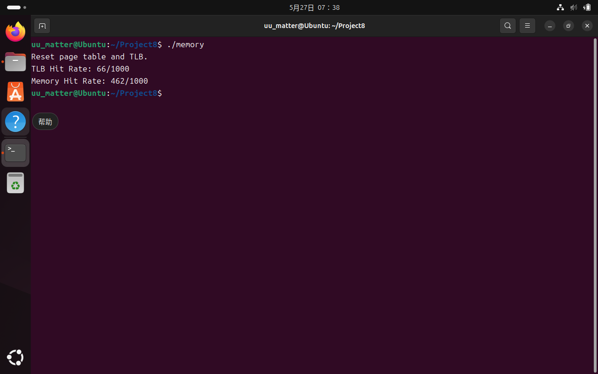

# Project 8 Report: Memory

## 全局变量声明

定义3个文件类型的指针，用于处理文件IO，分别读取内存访问的虚拟地址、读取模拟外存内容的二进制文件、写出访问记录：

```c
FILE *address;
FILE *external;
FILE *result_file;
```

定义结构体`pt_item`表示页表的条目，包括对应的物理页码`frame`和有效位`valid`；定义含有256个`pt_item`的`page_table`数组表示页表；寻址方式采用虚拟地址的`page`位作为索引（下标），对应的位置上存放物理页码
定义结构体`tlb_item`表示TLB的条目，包括虚拟页码和对应的物理页码；定义含有16个`tlb_item`的`tlb`数组表示TLB
定义含有[128]×[256]个`char`的二维数组`memory`表示内存内容

```c
struct pt_item{
    bool valid;
    int frame;
};
struct pt_item page_table[256];

struct tlb_item{
    int page;
    int frame;
};
struct tlb_item tlb[16];

char memory[128][256];
```

最后定义2个指针，在FIFO调页策略中应用

```c
int tlb_p = 0;
int mem_p = 0;
```

## 初始化

将页表各条目有效位设为`false`，对应物理页码设为`-1`；
将TLB各条目的虚拟页码和物理页码均设为`-1`

```c
void initialize()
{
    for (int i = 0; i < 256; i++)
    {
        page_table[i].valid = false;
        page_table[i].frame = -1;
    }
    for (int i = 0; i < 16; i++)
    {
        tlb[i].page = -1;
        tlb[i].frame = -1;
    }
    printf("Reset page table and TLB.\n");
}
```

## `main`函数

### 准备工作

打开文件，初始化TLB和页表，并定义处理内存访问请求过程中可能用到的各参数：
`addr`：内存访问请求的地址；
`page`：虚拟页码；
`offset`：页内偏移量，虚拟内存与物理内存相同；
`frame`：物理页码；
`visit`：访问内存次数；
`tlb_hit`：TLB命中次数；
`memory_hit`：内存命中次数；

```c
address = fopen("address.txt", "r");
external = fopen("BACKING_STORE.bin", "rb");
result_file = fopen("result.txt", "w");
initialize();
int addr;
int page;
int offset;
int frame;
int visit = 0;
int tlb_hit = 0;
int memory_hit = 0;
```

### 内存访问处理循环

使用`while(fscanf(address, "%u", &addr) != EOF) {}`循环读取并处理每条内存访问请求，并在文件达到末尾时结束，内容如下：

#### 参数处理

每次访问时，访问次数+1，取地址前8位作为虚拟页码，后8位作为页内偏移量

```c
visit++;
page = addr>>8;
offset = addr % 256;
```

#### 判断TLB是否命中

遍历TLB，页表项的`page`和内存访问地址的`page`相等时，页表项命中，即TLB命中

```c
bool in_tlb = false;
for (int i = 0; i < 16; i++)
    if (page == tlb[i].page)
    {
        tlb_hit++;
        memory_hit++;
        in_tlb = true;
        frame = tlb[i].frame;
        break;
    }
```

#### TLB未命中时判断内存是否命中

直接以虚拟页码作为下标访问页表项，并检查`valid`，若为`true`则内存命中，若为`false`则内存未命中
内存命中时，按照FIFO刷新TLB表项，并返回物理页码；
内存未命中时，将原本指向FIFO调页目标物理页码的页表项的`valid`改为`false`，表示该内存块已刷新，之前的访问方式不再有效；若该条目位于TLB中，则同时将TLB的条目刷新；若不在TLB则待下次TLB未命中但内存未命中时刷新；最后返回调页后的物理页码

```c
if (!in_tlb)
{
    bool in_page = false;
    if (page_table[page].valid)
    {
        memory_hit++;
        in_page = true;
        frame = page_table[page].frame;
        tlb[tlb_p].page = page;
        tlb[tlb_p].frame = frame;
        tlb_p = (tlb_p+1) % 16;
    }
    else
    {
        for (int i = 0; i < 256; i++)
            if (page_table[i].frame == mem_p)
                page_table[i].valid = false;
        for (int i = 0; i < 16; i++)
            if (tlb[i].frame == mem_p)
                tlb[i].page = page;
        fseek(external, page*256, SEEK_SET);
        fread(memory[mem_p], sizeof(char), 256, external);
        page_table[page].frame = mem_p;
        page_table[page].valid = true;
        frame = mem_p;
        mem_p = (mem_p+1) % 128;
    }
}
```

#### 报告访问结果

计算物理地址（物理页码×页面大小+页内偏移量）保存在`phy_addr`中；
从模拟内存`memory`中读取数据；
将访问记录及结果写出至`result_file`指向的文件中

```c
int phy_addr = frame * 256 + offset;
int data = memory[frame][offset];
fprintf(result_file, "Vir: %d, Phy: %d, Data: %d\n", addr, phy_addr, data);
```

### 报告TLB命中和内存命中情况

将统计的TLB命中情况和内存命中情况进行报告

```c
printf("TLB Hit Rate: %d/%d\n", tlb_hit, visit);
printf("Memory Hit Rate: %d/%d\n", memory_hit, visit);
```

## 效果展示

访问记录位于`Source Code\result.txt`中，统计TLB和内存命中率如下图：


